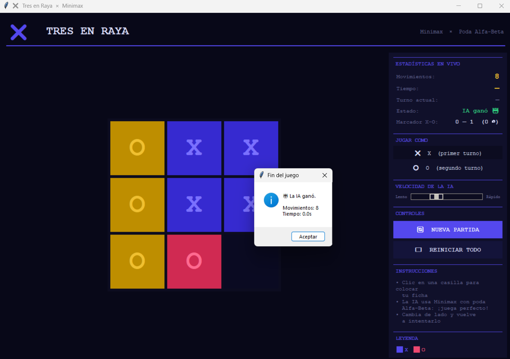

# Juego 3 en Raya

Aplicación de escritorio en Python para jugar tres en raya contra una IA que utiliza el algoritmo **Minimax** con **poda alfa-beta**. La interfaz está implementada con **Tkinter**.

## Captura de pantalla



Coloca la imagen `captura.png` en la carpeta `assets/` para que se muestre correctamente en este repositorio.

## Características

- Partida humano contra IA con jugadas óptimas para la máquina.
- Elección de bando: jugar como **X** o como **O**.
- Motor de juego basado en funciones de estado (`player`, `actions`, `result`, `winner`, `terminal`, `utility`).
- Minimax con poda alfa-beta ejecutado en un hilo secundario para no bloquear la interfaz.
- Registro de marcador (victorias de X, de O y empates).
- Cronómetro de partida y control de velocidad de respuesta de la IA (retraso visual configurable).

## Requisitos

- Python 3.8 o superior.
- Módulo `tkinter` (incluido en la instalación estándar de Python en Windows y macOS). En Linux, si no está disponible, instala el paquete del sistema correspondiente (por ejemplo `python3-tk` en Debian/Ubuntu).

No se requieren paquetes instalables con `pip`; consulta `requirements.txt` para más detalle.

## Instalación y ejecución

1. Clona el repositorio:

   ```bash
   git clone https://github.com/<usuario>/Juego3EnRaya.git
   cd Juego3EnRaya
   ```

2. (Opcional) Crea y activa un entorno virtual:

   ```bash
   python -m venv .venv
   # Windows
   .venv\Scripts\activate
   # Linux / macOS
   source .venv/bin/activate
   ```

3. Ejecuta la aplicación:

   ```bash
   python main.py
   ```

## Estructura del proyecto

```
Juego3EnRaya/
├── main.py           # Lógica del juego, Minimax e interfaz gráfica
├── assets/
│   └── captura.png   # Captura de pantalla para documentación
├── requirements.txt
├── .gitignore
└── README.md
```

## Uso

1. Inicia la aplicación con `python main.py`.
2. En el panel lateral, elige si juegas como **X** o **O**.
3. Haz clic en una casilla vacía cuando sea tu turno.
4. La IA responderá automáticamente con la mejor jugada según Minimax.
5. Usa **Nueva partida** para reiniciar el tablero o **Reiniciar todo** para borrar también el marcador.

Con la IA en su nivel óptimo, una victoria del jugador humano solo es posible si la máquina comete un error o si el humano juega primero y la partida termina en empate en el mejor juego de ambos lados.

